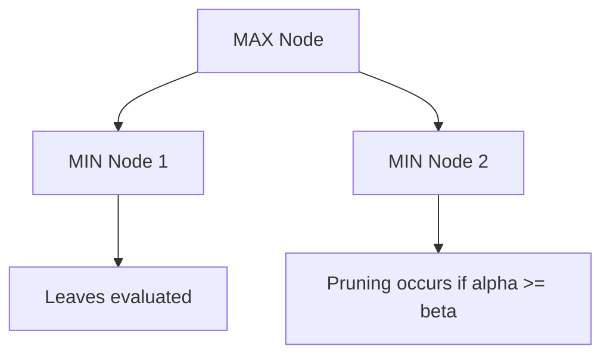

# CSE422: Artificial Intelligence — Ultimate Lab & Midterm Survival Guide

This survival guide compiles step-by-step mathematical solutions, formula cheat sheets, conceptual breakdowns, and practical optimization "hacks" derived from course quizzes, assignments, and past exams.

---

## 1. Classical AI Search Algorithms (Pathfinding)

### Greedy Best-First Search (GBFS) vs. A\* Search
The fundamental difference between Greedy Best-First Search and A\* Search lies in their **evaluation functions** $f(n)$.

| Feature | Greedy Best-First Search (GBFS) | A\* Search |
| :--- | :--- | :--- |
| **Evaluation Function** | $f(n) = h(n)$ | $f(n) = g(n) + h(n)$ |
| **Path Cost Awareness** | Blind to path cost $g(n)$ incurred so far. | Balances path cost $g(n)$ and future heuristic estimate $h(n)$. |
| **Optimality** | Suboptimal. Chases nodes that look close but may cost more overall. | Optimal (if $h(n)$ is admissible/consistent). |
| **Completeness** | Incomplete. Can easily get trapped in infinite loops in graphs. | Complete (guarantees finding a path if one exists). |

---

### Admissibility vs. Consistency of Heuristics
*   **Admissibility:** A heuristic $h(n)$ is admissible if it never overestimates the true cost to reach the goal node $G$ from node $n$.
    $$h(n) \le h^*(n) \quad \forall n$$
    *Where $h^*(n)$ is the true minimum cost to reach the goal from node $n$.*
*   **Consistency (Monotonicity):** A heuristic $h(n)$ is consistent if, for every node $n$ and every successor $n'$ generated by action $a$, the estimated cost of reaching the goal from $n$ is no greater than the single-step cost to $n'$ plus the estimated cost from $n'$.
    $$h(n) \le c(n, a, n') + h(n') \quad \forall n, n'$$
*   **Key Theorem:** 
    *   For **Tree Search**, A\* requires only an **admissible** heuristic to guarantee optimality.
    *   For **Graph Search**, A\* requires a **consistent** heuristic to guarantee optimality. This is due to **Closed Set Invariance** (once a node is expanded and added to the closed/visited set, its path is finalized and it won't be reopened. An inconsistent heuristic might visit a node via a suboptimal path first and lock it).

---

### Tracing Graph Search (Example from Assignment 1, Q1)
Consider a graph with start node $A$ and goal node $X$ (where $h(X) = 0$).

#### Given Heuristic Table:
*   $h(A) = 7, \quad h(B) = 5, \quad h(C) = 6, \quad h(D) = 3$
*   $h(E) = 4, \quad h(F) = 4, \quad h(G) = 2, \quad h(H) = 2, \quad h(X) = 0$

#### Given Edge Costs:
*   $A \to B (5), \quad A \to C (3), \quad A \to E (2)$
*   $B \to D (2), \quad B \to E (1)$
*   $C \to E (1), \quad C \to F (1)$
*   $D \to X (4)$
*   $E \to F (3), \quad E \to H (2)$
*   $F \to G (4), \quad F \to H (1)$
*   $G \to X (1)$
*   $H \to X (5)$

#### 1. Greedy Best-First Search (GBFS) Trace (Tree Version)
GBFS expands the node with the lowest heuristic value $f(n) = h(n)$:
1.  **Start:** $A \quad [h=7]$
2.  **Expand $A$:** Children are $B \ [h=5]$, $C \ [h=6]$, $E \ [h=4]$. Choose $E$.
3.  **Expand $E$:** Children are $F \ [h=4]$, $H \ [h=2]$. Choose $H$.
4.  **Expand $H$:** Child is $X \ [h=0]$. Goal reached!
*   **Path:** $A \to E \to H \to X$
*   **Total Cost:** $2 + 2 + 5 = 9$

#### 2. A\* Search Trace (Tree Version)
A\* expands based on $f(n) = g(n) + h(n)$:
1.  **Start:** $A \quad [g=0, f=0+7=7]$
2.  **Expand $A$:**
    *   $B: g=5, f=5+5=10$
    *   $C: g=3, f=3+6=9$
    *   $E: g=2, f=2+4=6$
    *   *Frontier:* $\{E (6), C (9), B (10)\}$
3.  **Expand $E$ (lowest $f$):**
    *   $F: g=2+3=5, f=5+4=9$
    *   $H: g=2+2=4, f=4+2=6$
    *   *Frontier:* $\{H (6), C (9), F (9), B (10)\}$
4.  **Expand $H$ (lowest $f$):**
    *   $X: g=4+5=9, f=9+0=9$
    *   *Frontier:* $\{C (9), F (9), X (9), B (10)\}$
5.  **Expand $C$ (lowest $f$):**
    *   $E: g=3+1=4, f=4+4=8$
    *   $F: g=3+1=4, f=4+4=8$
    *   *Frontier:* $\{E (8), F (8), X (9), B (10)\}$
6.  **Expand $E$ (lowest $f$):**
    *   $H: g=4+2=6, f=6+2=8$
    *   *Frontier:* $\{F (8), H (8), X (9), B (10)\}$
7.  **Expand $F$ (lowest $f$):**
    *   $G: g=4+4=8, f=8+2=10$
    *   *Frontier:* $\{H (8), X (9), G (10), B (10)\}$
8.  **Expand $H$ (lowest $f$):**
    *   $X: g=6+5=11, f=11+0=11$ (Not expanded yet since other nodes are cheaper)
9.  **Pull cheapest goal path:** Eventually, A\* explores $A \to C \to G \to X$ yielding $f=8$.
*   **Path:** $A \to C \to G \to X$
*   **Total Cost:** $3 + 4 + 1 = 8$

#### 3. Admissibility Verification & Correction
Check if $h(n) \le h^*(n)$ for all nodes:
*   From $C$: True cheapest path to $X$ is $C \to G \to X$ with cost $4+1=5$. But $h(C) = 6$. Since $6 > 5$, **node $C$ violates admissibility**.
*   From $G$: True cheapest path to $X$ is $G \to X$ with cost $1$. But $h(G) = 2$. Since $2 > 1$, **node $G$ violates admissibility**.
*   **Correction:** To restore admissibility with the maximum possible values, update:
    $$\mathbf{h(C) = 5}, \quad \mathbf{h(G) = 1}$$

---

### Admissible but Inconsistent Graph Construction (Assignment 1, Q2)
To build a graph of four nodes where the heuristic is admissible but not consistent:
*   **Nodes:** Start ($S$), Node ($A$), Node ($B$), Goal ($G$).
*   **Edges & Costs:** $S \to A \ (2)$, $A \to G \ (3)$, $S \to B \ (1)$, $B \to G \ (10)$.
*   **Heuristics:** $h(S)=5, \quad h(A)=3, \quad h(B)=2, \quad h(G)=0$.
*   **Proof of Admissibility:** True optimal costs to $G$ are $S=5$, $A=3$, $B=10$. Since all $h(n) \le \text{true cost}$, it is admissible.
*   **Proof of Inconsistency:** Check edge $S \to B$:
    $$h(S) \le c(S, B) + h(B) \implies 5 \le 1 + 2 \implies 5 \le 3 \quad (\text{False!})$$
    Since the triangle inequality is violated, the heuristic is inconsistent.

---

### Grid Pathfinding (Assignment 1, Q4)
*   **Euclidean Distance** (straight-line distance) is **ineffective** on grids with orthogonal-only movement, obstacles (`#`), and high hazard penalty zones ($R$ costing 10). A\* will severely underestimate costs and expand too many nodes.
*   **Manhattan Distance** is the optimal heuristic for orthogonal grid movement:
    $$h(n) = |x_n - x_{\text{goal}}| + |y_n - y_{\text{goal}}|$$

---

## 2. Genetic Algorithms (GA) Formulation

### Chromosome Encoding Selection Rules
*   **Binary Encoding:** Use when features represent binary state decisions (inclusion/exclusion like the 0/1 Knapsack) or when the search space maps exactly to a power of $2$ (e.g., representing numbers $0 \text{ to } 15$ with exactly 4 genes: $2^4 = 16$).
*   **Value Encoding:** Use when variables represent categorical designations (e.g., assigning 6 AI systems to 3 zones) or a wide range of continuous/discrete numbers (e.g., values $1 \text{ to } 50$) where binary conversion is mathematically tedious.
*   **Permutation Encoding:** Use when order/sequence is key and values cannot repeat (e.g., Traveling Salesman Problem, 8-Queens).

---

### Formulation Examples

#### 1. Delivery Robot Knapsack (Mock Midterm, Q2)
*   **Goal:** Select exactly 5 packages out of 20 to maximize priority score under a 50 kg weight limit.
*   **Chromosome:** Value encoding. An array of 5 distinct integers where each element is in the range $[1, 20]$ representing the selected package IDs. E.g., $c = [3, 8, 12, 15, 18]$.
*   **Fitness Function:** 
    $$\text{fitness}(c) = \begin{cases} \sum_{i \in c} \text{Priority}_i & \text{if } \sum_{i \in c} \text{Weight}_i \le 50 \\ 0 & \text{if } \sum_{i \in c} \text{Weight}_i > 50 \end{cases}$$
    *(Tip: Subtracting a heavy penalty for every kg over 50 creates a smoother gradient for search convergence than dropping to a hard 0).*
*   **Mutation:** Randomly select an index and replace the package ID with a new package ID not currently in the chromosome (to avoid duplicates).

#### 2. Root Finding for $f(x) = x^2 - 5x + 6 = 0$ (Assignment 1, Q5)
*   **Goal:** Find $x \in [0, 15]$ such that $f(x) = 0$.
*   **Chromosome:** Binary encoding. A 4-bit binary string (e.g., $0010_2 = 2_{10}$). Length is 4 because $2^4 = 16$ states ($0 \text{ to } 15$).
*   **Fitness Function:** Since we want $f(x) = 0$, we maximize:
    $$Fitness(x) = \frac{1}{1 + |x^2 - 5x + 6|}$$
    *If $x=2$ or $x=3$, $Fitness(x) = 1$ (global maximum).*

#### 3. AI Surveillance Deployment (Assignment 1, Q7)
*   **Goal:** Assign 6 systems to 3 zones avoiding 7 conflicting system pairings.
*   **Chromosome:** Value encoding. An array of 6 genes representing the systems, where each gene has a value of $1$, $2$, or $3$ (the zones). E.g., $[Z_F, Z_L, Z_S, Z_D, Z_C, Z_W]$.
*   **Fitness Function:**
    $$Fitness = 7 - (\text{Total Violated Constraints})$$
*   **Mutation Rate Discussion:**
    *   *Too High:* Destroys good genetic material ("building blocks"), causing the algorithm to behave like a purely random search.
    *   *Too Low:* Stagnates exploration, causing the population to get stuck in local optima.

---

## 3. Local Search Algorithms

### Hill Climbing vs. Simulated Annealing
*   **Hill Climbing:** Always moves to a neighboring state with higher evaluation. Its main vulnerability is getting trapped at **local maxima**, **plateaus**, or **ridges** because it refuses to take downhill steps.
*   **Simulated Annealing:** Escapes local traps by allowing downhill moves with a probability:
    $$P = e^{\frac{\Delta E}{T}}$$
    *   **High Temperature ($T$):** Early phase. $P$ is high, meaning the algorithm behaves randomly to explore the space and jump out of local peaks.
    *   **Low Temperature ($T \to 0$):** Late phase. $P \to 0$, meaning the algorithm cools down, stops taking bad steps, and acts like greedy Hill Climbing to lock onto the nearest peak.

---

### 8-Queens Concept Explanations (Assignment 1, Q11)
*   **Local Maximum:** A board configuration (e.g., $13528647$ with 5 attacking pairs) where any single queen movement (up, down, left, right) increases the number of attacks (worsening the board). The algorithm gets trapped here.
*   **Plateau:** A flat region of the search space (e.g., $13572864$ with 3 attacking pairs) where neighboring configurations yield the exact same evaluation score. The algorithm wanders aimlessly with no gradient direction.

---

## 4. Adversarial Search (Games)

### Alpha-Beta Pruning Cut-Off Conditions
Alpha-Beta pruning speeds up Minimax by skipping branches that cannot influence the final decision.
*   $\alpha$ is the lower bound on MAX's score (MAX updates $\alpha$, representing the best choice for MAX so far).
*   $\beta$ is the upper bound on MIN's score (MIN updates $\beta$, representing the best choice for MIN so far).
*   **Pruning Trigger:** A cut-off occurs the moment:
    $$\alpha \ge \beta$$

*   **Alpha Cut-off:** Occurs at a **MIN node** (which updates $\beta$) when evaluating its children. If the node's updated $\beta$ value falls below or equal to the inherited $\alpha$ from above ($\beta \le \alpha$), we prune the remaining unexamined children.
*   **Beta Cut-off:** Occurs at a **MAX node** (which updates $\alpha$) when evaluating its children. If the node's updated $\alpha$ value rises above or equal to the inherited $\beta$ from above ($\alpha \ge \beta$), we prune the remaining unexamined children.

---

## 5. Supervised Learning: Linear vs. Logistic Regression

### Core Comparison

| Feature | Linear Regression | Logistic Regression |
| :--- | :--- | :--- |
| **Purpose** | Predicting continuous numeric values (Regression). | Predicting categorical class labels (Classification). |
| **Output Range** | Infinite $(-\infty, \infty)$ | Probability bounded between $[0, 1]$ |
| **Equation / Curve** | Straight Line: $y = wx + b$ | Sigmoid S-Curve: $a = \frac{1}{1 + e^{-z}}$ where $z = wx+b$ |
| **Standard Loss** | Mean Squared Error (MSE) / Sum of Squared Residuals (SSR) | Log Loss / Binary Cross-Entropy (BCE) |

---

### Why we cannot use MSE / SSR for Logistic Regression
1.  **Wrong Metric:** MSE measures physical distances between points and a line, which is irrelevant for distinct "Yes/No" categories.
2.  **Squeezed Penalty:** In classification, predictions are probabilities in $[0, 1]$. Squaring a decimal difference (which is $< 1$) makes the resulting error value even smaller, failing to penalize confidently wrong predictions.
3.  **Optimization Traps:** Combining the non-linear Sigmoid function with MSE yields a non-convex loss function. This introduces local maxima, plateaus, and ridges into the landscape, causing Gradient Descent to get stuck.
4.  **Logarithmic Solution:** Log Loss (BCE) uses logarithms to generate an infinitely large penalty ($-\ln(0) \to \infty$) for incorrect predictions, guiding the model stably.

---

## 6. Gradient Descent Derivations & Calculations

### Univariate Linear Regression Analytical (Closed-Form) Equations
To calculate the absolute best-fit line parameters without iterating:
*   **Slope ($w_1$):**
    $$w_1 = \frac{m\sum(xy) - \sum(x)\sum(y)}{m\sum(x^2) - (\sum x)^2}$$
*   **Intercept ($w_0$):**
    $$w_0 = \frac{1}{m} \left( \sum y - w_1 \sum x \right)$$
*   *Where $m$ is the total number of data points.*

---

### Linear Regression Update Trace (Fall 2024 Final, Q4)
*   **Data ($N=3$):** Age $x_1 = [2, 3, 4]$, Height $x_2 = [3, 4, 5]$, Weight $y = [4, 5, 6]$
*   **Initial Guess:** $m_1 = 0.4, \quad m_2 = 0.5, \quad c = 0.6, \quad \text{Learning Rate } \alpha = 0.1$
*   **Hypothesis:** $y' = m_1 x_1 + m_2 x_2 + c$

#### Step 1: Calculate Predictions ($y'_i$) and Errors ($y_i - y'_i$)
*   **Point 1:** $y'_1 = 0.4(2) + 0.5(3) + 0.6 = 2.9 \implies \text{Error} = 4 - 2.9 = 1.1$
*   **Point 2:** $y'_2 = 0.4(3) + 0.5(4) + 0.6 = 3.8 \implies \text{Error} = 5 - 3.8 = 1.2$
*   **Point 3:** $y'_3 = 0.4(4) + 0.5(5) + 0.6 = 4.7 \implies \text{Error} = 6 - 4.7 = 1.3$

#### Step 2: Compute Gradient Sums
*   $\sum (\text{Error}_i) = 1.1 + 1.2 + 1.3 = 3.6$
*   $\sum (\text{Error}_i \cdot x_{1i}) = (1.1 \cdot 2) + (1.2 \cdot 3) + (1.3 \cdot 4) = 2.2 + 3.6 + 5.2 = 11.0$
*   $\sum (\text{Error}_i \cdot x_{2i}) = (1.1 \cdot 3) + (1.2 \cdot 4) + (1.3 \cdot 5) = 3.3 + 4.8 + 6.5 = 14.6$

#### Step 3: Calculate Gradients (Using MSE Loss $L = \frac{1}{N}\sum(y-y')^2$)
Using the exact derivative chain rule yields a $-\frac{2}{N}$ multiplier:
$$\frac{\partial L}{\partial c} = -\frac{2}{N}\sum(y - y') = -\frac{2}{3}(3.6) = -2.4$$
$$\frac{\partial L}{\partial m_1} = -\frac{2}{N}\sum(y - y')x_1 = -\frac{2}{3}(11.0) \approx -7.333$$
$$\frac{\partial L}{\partial m_2} = -\frac{2}{N}\sum(y - y')x_2 = -\frac{2}{3}(14.6) \approx -9.733$$

#### Step 4: Parameter Update ($w_{\text{new}} = w_{\text{old}} - \alpha \cdot \text{Gradient}$)
*   $c_{\text{new}} = 0.6 - 0.1(-2.4) = \mathbf{0.84}$
*   $m_{1(\text{new})} = 0.4 - 0.1(-7.333) = \mathbf{1.133}$
*   $m_{2(\text{new})} = 0.5 - 0.1(-9.733) = \mathbf{1.473}$
*(If using the course's simplified convention where constants are absorbed: $w_{\text{new}} = w_{\text{old}} + \frac{\alpha}{N}\sum(\text{Error})x \implies c_{\text{new}}=0.72$, $m_{1(\text{new})} \approx 0.767$, $m_{2(\text{new})} \approx 0.987$).*

---

### Logistic Regression Update Trace (Assignment, Q8)
*   **Data ($N=3$):** $X = [0.2, 0.4, 0.8]$, Target $Y = [0, 0, 1]$
*   **Initial Guess:** $m = 3, \quad b = 1, \quad \text{Learning Rate } \alpha = 0.1$
*   **Hypothesis:** $z = mX^2 + b, \quad \hat{Y} = \sigma(z) = \frac{1}{1 + e^{-z}}$

#### Step 1: Calculate Linear Combinations ($z_i$) and Predictions ($\hat{Y}_i$)
*   **Point 1:** $z_1 = 3(0.2^2) + 1 = 1.12 \implies \hat{Y}_1 = \sigma(1.12) = \frac{1}{1 + e^{-1.12}} \approx 0.754$
*   **Point 2:** $z_2 = 3(0.4^2) + 1 = 1.48 \implies \hat{Y}_2 = \sigma(1.48) = \frac{1}{1 + e^{-1.48}} \approx 0.815$
*   **Point 3:** $z_3 = 3(0.8^2) + 1 = 2.92 \implies \hat{Y}_3 = \sigma(2.92) = \frac{1}{1 + e^{-2.92}} \approx 0.949$

#### Step 2: Calculate Binary Cross-Entropy Loss
$$\text{Loss}_i = - [Y_i \ln(\hat{Y}_i) + (1-Y_i)\ln(1-\hat{Y}_i)]$$
*   **Point 1 ($Y_1=0$):** $-\ln(1 - 0.754) = -\ln(0.246) \approx 1.402$
*   **Point 2 ($Y_2=0$):** $-\ln(1 - 0.815) = -\ln(0.185) \approx 1.687$
*   **Point 3 ($Y_3=1$):** $-\ln(0.949) \approx 0.052$
*   **Average BCE Loss:** $\text{Loss} = \frac{1.402 + 1.687 + 0.052}{3} = \mathbf{1.047}$

#### Step 3: Compute Errors ($Y - \hat{Y}$) and Gradients
*   $\text{Error}_1 = 0 - 0.754 = -0.754$
*   $\text{Error}_2 = 0 - 0.815 = -0.815$
*   $\text{Error}_3 = 1 - 0.949 = 0.051$
*   **Bias Gradient ($b$):** $\text{Grad}_b = -\frac{1}{N}\sum(Y-\hat{Y}) = -\frac{1}{3}(-1.518) = 0.506$
*   **Weight Gradient ($m$):** Since $z = mX^2 + b$, the derivative with respect to $m$ includes $X^2$:
    $$\text{Grad}_m = -\frac{1}{N}\sum(Y-\hat{Y})X^2 = -\frac{1}{3}[(-0.754 \cdot 0.04) + (-0.815 \cdot 0.16) + (0.051 \cdot 0.64)] = -\frac{1}{3}[-0.1279] \approx 0.0426$$

#### Step 4: Parameter Update
*   $b_{\text{new}} = b_{\text{old}} - \alpha \cdot \text{Grad}_b = 1 - 0.1(0.506) = \mathbf{0.9494}$
*   $m_{\text{new}} = m_{\text{old}} - \alpha \cdot \text{Grad}_m = 3 - 0.1(0.0426) = \mathbf{2.9957}$
*(Using the course's positive addition convention $w_{\text{old}} + \alpha \frac{1}{N}\sum(Y-\hat{Y})X$ yields identical numerical values).*

---

### Un-Normalized Gradient Descent Oscillation Hack (GRE / Loan Default Problems)
In questions like **GRE/GPA Admission Prediction**, the input features are large un-normalized values (GRE scores $\approx 300+$).
*   **Observation:** In the first iteration, because features are large, $\hat{Y} \to 1.0$ for all records.
*   **Consequence:** Gradients explode to massive values (e.g., $w_1$ shifts from $+1$ to $-113$).
*   **Next step:** The prediction swings completely in the opposite direction ($\hat{Y} \to 0.0$), causing the parameters to aggressively oscillate.
*   **Exam Hack:** When you see large un-normalized inputs, expect predictions to hit exactly $1.0$ or $0.0$ boundaries. Use this to simplify Sigmoid evaluations without needing a calculator.

---

## 7. Probability Theory & Naive Bayes Classifier

### Naive Bayes Calculation (Assignment, Q1)
Predict target $Y$ for instance $X = (X_1=1, \ X_2=a, \ X_3=q)$ given a dataset of 9 rows.

*   **Priors:** $P(Y=1) = \frac{5}{9}, \quad P(Y=0) = \frac{4}{9}$
*   **Likelihoods for $Y=1$:**
    *   $P(X_1=1 | Y=1) = 1/5$
    *   $P(X_2=a | Y=1) = 1/5$
    *   $P(X_3=q | Y=1) = 2/5$
*   **Likelihoods for $Y=0$:**
    *   $P(X_1=1 | Y=0) = 1/4$
    *   $P(X_2=a | Y=0) = 2/4$
    *   $P(X_3=q | Y=0) = 1/4$
*   **Posterior Score Proportions:**
    *   $\text{Score}(Y=1) = \frac{5}{9} \times \frac{1}{5} \times \frac{1}{5} \times \frac{2}{5} = \frac{10}{1125} \approx 0.0089$
    *   $\text{Score}(Y=0) = \frac{4}{9} \times \frac{1}{4} \times \frac{2}{4} \times \frac{1}{4} = \frac{8}{576} \approx 0.0139$
*   **Decision:** Since $0.0139 > 0.0089$, the predicted class is **$Y=0$**.

---

### Bayes' Theorem Problems

#### 1. Medical Test Sensitivity (Assignment, Q3)
*   **Prevalence:** $P(V) = 0.01 \quad (\text{so } P(\neg V) = 0.99)$
*   **Test A:** $P(T_A | V) = 0.95, \quad P(T_A | \neg V) = 0.10$
*   **Test B:** $P(T_B | V) = 0.90, \quad P(T_B | \neg V) = 0.05$

Applying Bayes' Theorem $P(V | T) = \frac{P(T|V)P(V)}{P(T|V)P(V) + P(T|\neg V)P(\neg V)}$:
*   **Test A Posterior:**
    $$P(V | T_A) = \frac{0.95 \cdot 0.01}{0.95 \cdot 0.01 + 0.10 \cdot 0.99} = \frac{0.0095}{0.1085} \approx \mathbf{8.76\%}$$
*   **Test B Posterior:**
    $$P(V | T_B) = \frac{0.90 \cdot 0.01}{0.90 \cdot 0.01 + 0.05 \cdot 0.99} = \frac{0.0090}{0.0585} \approx \mathbf{15.38\%}$$
*   **Rule of Thumb:** For rare events, a test with a **lower false positive rate** (Test B at 5%) is significantly more reliable than a test with higher sensitivity but a worse false positive rate (Test A at 10%).

#### 2. Factory Worker Productivity (Assignment, Q9)
*   **Priors:** Highly trained $P(H) = 0.35$, Moderately trained $P(M) = 0.40$, Untrained $P(U) = 0.25$.
*   **Likelihoods of Success ($S$):** $P(S|H) = 0.80, \quad P(S|M) = 0.50, \quad P(S|U) = 0.00$.
*   **Step 1: Law of Total Probability for $P(S)$:**
    $$P(S) = (0.80 \cdot 0.35) + (0.50 \cdot 0.40) + (0.00 \cdot 0.25) = 0.28 + 0.20 + 0 = 0.48$$
*   **Step 2: Bayes' Rule for $P(H|S)$:**
    $$P(H | S) = \frac{P(S | H) P(H)}{P(S)} = \frac{0.28}{0.48} = \frac{\mathbf{7}}{\mathbf{12}} \approx \mathbf{58.33\%}$$
